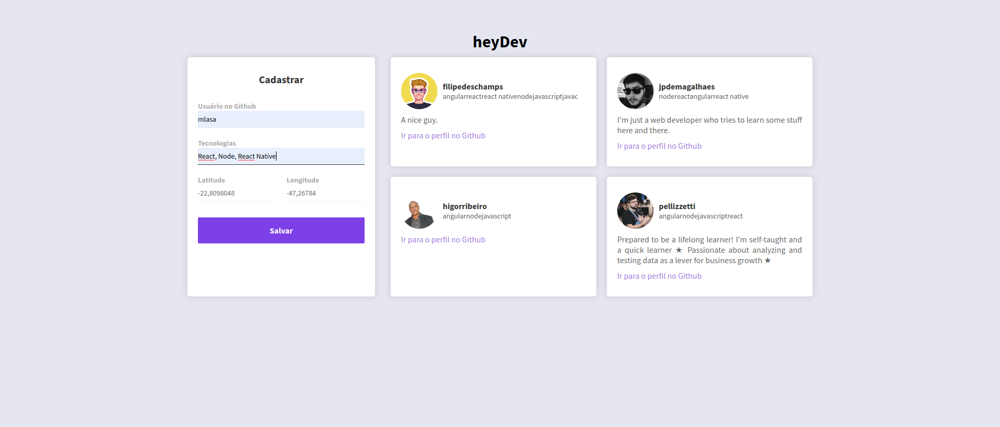
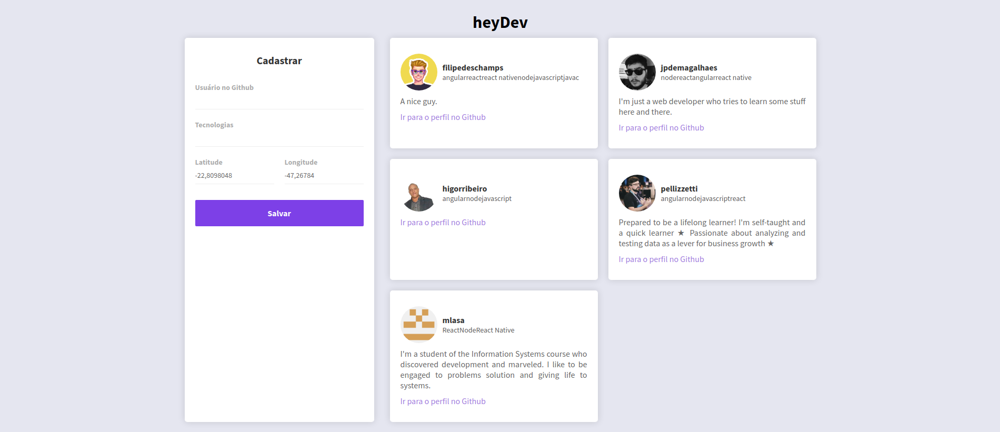

<h1 align="center">heyDev</h1>
<p align="center"> O nome original desse projeto é DevRadar, mas por opção eu alterei.</p>
<h5 align="center"> 🚀Este projeto foi desenvolvido durante a Semana Omnistack 10.0</h5>

### 💡O que é heyDev?
<p align="justify">
O heyDev foi desenvolvido pensando em conectar os desenvolvedores próximos uns dos outros visando networking, colaboração
em projetos, etc.

Ele possui um mapa, onde é possível ver quais desenvolvedores estão próximos da sua localização atual, e se
você deseja pode buscar por desenvolvedores de uma tecnologia especfica.

Cada desenvolvedor aparece como um ponto no mapa, e possui um link para seu repositório de projetos e também suas tecnologias favoritas.
</p>

## 🖥 Projeto
<p>
É um projeto web e mobile, a parte  web foi pensada para que os desenvolvedores pudessem se cadastrar. E a parte mobile é onde
os desenvolvedores podem procurar uns pelos outros.
</p>

## Imagens




## 🔧 Tecnologias

<p>
O projeto foi divido em back-end e front-end porque foi usado o estilo arquitetural REST.

Então no back-end foi usado:
- Node.js

E no front-end:
- React
- React Native

E no banco de dados:
- Banco de dados MongoDB
- NoSQL

</p>

## 🖱 Instalação e Execução
<p>
 <strong>Banco de Dados</strong>
  
  - Configure o MongoDB
  - Altere a string de conexão no arquivo .env, dentro da pasta backend, com com seu usuário e senha do banco de dados.

<strong>Back-End</strong>

  Para instalar as dependências e executar o servidor no modo de desenvolvimento:
  - Clone o projeto no seu computador
  - Vá até a pasta mais externa do projeto e execute:
      ```bash
      cd backend
      yarn install
      yarn dev
    ```

<strong>Web</strong>

Para instalar as dependências e iniciar o Front-End(web):
   - Volte até a pasta mais externa do projeto e execute:
        ```bash
        cd web
        yarn install
        yarn start
      ```
Após isso a página vai ser aberta automaticamente no seu navegador

<strong>Mobile</strong> 

- Coloque o endereço do seu servidor backend dentro da pasta mobile no arquivo src/services/api.js
- Execute os comandos:
     ```bash
     yarn global add install expo-cli
     cd mobile
     yarn install
     yarn start
   ```

Automaticamente seu navegador a página localhost:19000. Você pode conectar seu emulador ou então testar no aplicativo Expo, é só escanerar o QR Code com o Expo.


Para que você consiga testar tanto a parte web(Front-End), como a Mobile, você precisa estar com o servidor Back-End rodando.
Se quiser testar só o mobile, não precisa rodar o web, e vice versa.
</p>
